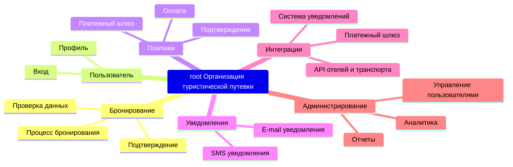
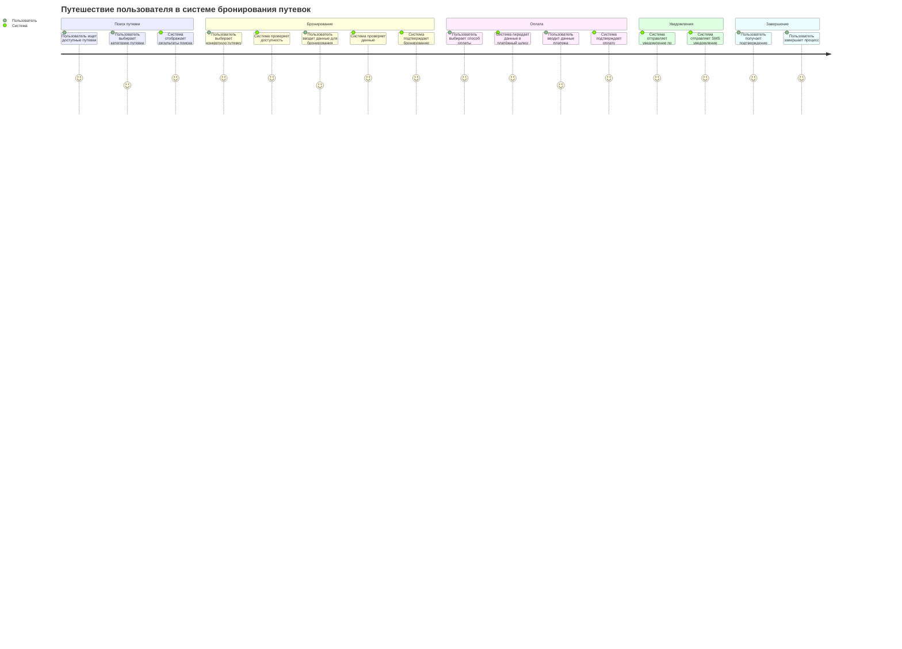
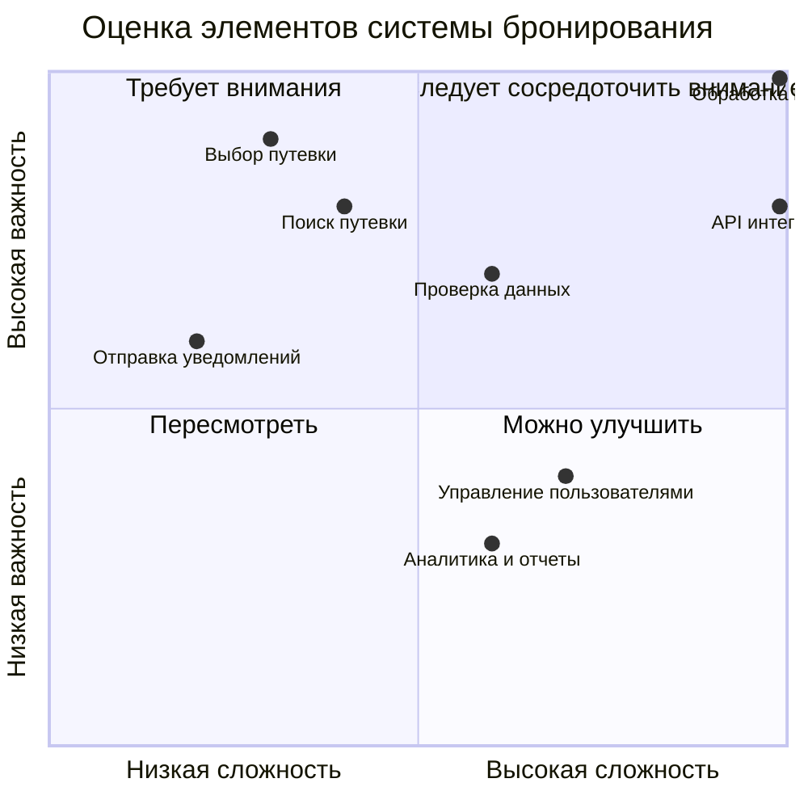
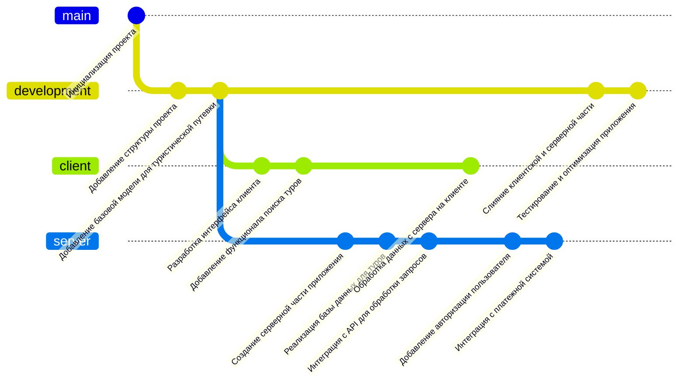

# Организация туристической путевки

Структуру функциональных возможностей (Mind Map)

```mermaid
mindmap
root Организация туристической путевки
  Бронирование
    Процесс бронирования
    Проверка данных
    Подтверждение
  Пользователь
    Вход
    Профиль
  Платежи
    Оплата
    Платежный шлюз
    Подтверждение
  Уведомления
    E-mail уведомления
    SMS уведомления
  Интеграции
    API отелей и транспорта
    Платежный шлюз
    Система уведомлений
  Администрирование
    Управление пользователями
    Аналитика
    Отчеты
```
Диаграммы путешествия пользователя

```mermaid
journey
  title Путешествие пользователя в системе бронирования путевок
  section Поиск путевки
    Пользователь ищет доступные путевки: 5: Пользователь
    Пользователь выбирает категорию путевки: 4: Пользователь
    Система отображает результаты поиска: 5: Система
  section Бронирование
    Пользователь выбирает конкретную путевку: 5: Пользователь
    Система проверяет доступность: 5: Система
    Пользователь вводит данные для бронирования: 4: Пользователь
    Система проверяет данные: 5: Система
    Система подтверждает бронирование: 5: Система
  section Оплата
    Пользователь выбирает способ оплаты: 5: Пользователь
    Система передает данные в платёжный шлюз: 5: Система
    Пользователь вводит данные платежа: 4: Пользователь
    Система подтверждает оплату: 5: Система
  section Уведомления
    Система отправляет уведомление по электронной почте: 5: Система
    Система отправляет SMS уведомление: 5: Система
  section Завершение
    Пользователь получает подтверждение бронирования: 5: Пользователь
    Пользователь завершает процесс: 5: Пользователь

```

Диаграммы Квадрант-граф

```mermaid
quadrantChart
  title Оценка элементов системы бронирования
  x-axis "Низкая сложность" --> "Высокая сложность"
  y-axis "Низкая важность" --> "Высокая важность"
  quadrant-1 "Следует сосредоточить внимание"
  quadrant-2 "Требует внимания"
  quadrant-3 "Пересмотреть"
  quadrant-4 "Можно улучшить"
  "Поиск путевки": [0.4, 0.8]
  "Выбор путевки": [0.3, 0.9]
  "Проверка данных": [0.6, 0.7]
  "Обработка платежа": [0.99, 0.99]
  "Отправка уведомлений": [0.2, 0.6]
  "Управление пользователями": [0.7, 0.4]
  "Аналитика и отчеты": [0.6, 0.3]
  "API интеграции": [0.99, 0.8]

```

Диаграммы Гит граф

```mermaid
gitGraph
  commit id: "Инициализация проекта"
  branch development
  commit id: "Добавление структуры проекта"
  commit id: "Добавление базовой модели для туристической путевки"
  branch client
  commit id: "Разработка интерфейса клиента"
  commit id: "Добавление функционала поиска туров"
  checkout development
  branch server
  commit id: "Создание серверной части приложения"
  commit id: "Реализация базы данных для туров"
  commit id: "Интеграция с API для обработки запросов"
  checkout client
  commit id: "Обработка данных с сервера на клиенте"
  checkout server
  commit id: "Добавление авторизации пользователя"
  commit id: "Интеграция с платежной системой"
  checkout development
  commit id: "Слияние клиентской и серверной части"
  commit id: "Тестирование и оптимизация приложения"
```
